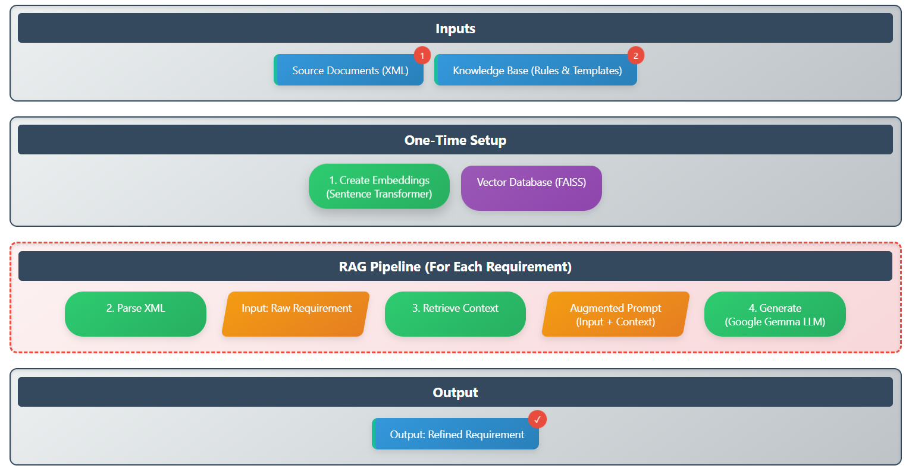

# Subject Domain Analysis Based On Text Mining Using a Large Language Model

**Author:** Dilki Sandunika Rathnayake (20242001)  
**University:** VILNIUS GEDIMINAS TECHNICAL UNIVERSITY (VILNIUS TECH)  
**Thesis:** Master Graduation Thesis, 2025

[](https://opensource.org/licenses/MIT)
[](https://www.python.org/downloads/)

---

## 1. Abstract

This repository contains the end-to-end implementation for the Master's thesis, "Subject Domain Analysis Based On Text Mining Using a Large Language Model." The project addresses the critical challenge of manually extracting Functional Requirements (FRs) from software documentation, a process that is often time-consuming, error-prone, and inconsistent.

This work proposes and implements a novel, automated pipeline that leverages a **Retrieval-Augmented Generation (RAG)** architecture. By combining the contextual retrieval of domain-specific knowledge with the advanced generative capabilities of Large Language Models (LLMs), this system extracts, validates, and standardizes FRs from unstructured text. The primary goal is to enhance the **consistency, compliance, and traceability** of requirements.

## 2. Key Features

*   **Automated FR Extraction:** Identifies and extracts functional requirements from raw XML documents.
*   **Automated Compliance Scoring:** Automatically validates the generated requirements against the knowledge base and provides a quantitative compliance score and detailed feedback.
*   **Retrieval-Augmented Generation (RAG):** Uses Google's Gemma model, grounded in retrieved context, to reduce hallucinations and improve accuracy.
*   **Modular and Reproducible:** The code is structured in Google Colab notebooks for easy, step-by-step reproduction of the results.

## 3. Architecture Overview

The core of this project is an end-to-end pipeline that takes source documents and a knowledge base as input and produces structured, validated functional requirements as output.

Below is a diagram illustrating the complete architecture of the RAG pipeline, from initial data ingestion to the final, refined output.



**High-Level Flow:**
`[Input Documents + Knowledge Base] -> [RAG Pipeline] -> [Structured, Validated FRs]`

**Detailed Steps:**
1.  **Ingestion & Indexing:** The knowledge base (containing compliance rules and templates) is loaded and indexed into a searchable FAISS vector database.
2.  **Input Processing:** A raw SRS document (in XML format) is parsed to extract a clean list of requirements.
3.  **Contextual Retrieval:** For a given requirement, the system retrieves the most relevant rules from the indexed knowledge base.
4.  **Augmented Prompting:** A detailed, context-rich prompt is constructed for the LLM, containing the original requirement and the retrieved knowledge.
5.  **Intelligent Generation:** The Google Gemma model processes the prompt to generate a refined, compliant functional requirement.

## 4. Results & Example Output

The end-to-end pipeline successfully demonstrates the ability to refine raw requirements into a compliant, well-formed format. The RAG system correctly retrieves relevant rules and uses them to guide the Gemma LLM in generating high-quality outputs.

Below are screenshots of the final output from the demonstration notebook (`03_end_to_end_pipeline_demo.ipynb`), showing the input, the retrieved context, and the final, improved functional requirements.


## 5. Technology Stack

*   **Language:** Python 3.10+
*   **Core Libraries:** Pandas, PyTorch, Transformers, BeautifulSoup4
*   **Generative LLM:** Google Gemma 2B-IT (via Hugging Face)
*   **Vector Database:** FAISS (from Meta AI)
*   **Text Embeddings:** Sentence-Transformers (`all-MiniLM-L6-v2`)
*   **Development Environment:** Google Colab (with T4 GPU)

## 6. How to Run the Demo

This project is designed to be run in Google Colab. Each notebook can be opened with a single click.
### A. Running on Google Colab (Recommended Method)

1.  **`01_data_exploration.ipynb`** - Parses the raw XML and creates a clean CSV of requirements.
    [](https://colab.research.google.com/github/DilkiSandunika/VGTU_Thesis_Project/blob/main/notebooks/01_data_exploration.ipynb)

2.  **`02_knowledge_base_creation.ipynb`** - Builds the vector database from the knowledge base files.
    [](https://colab.research.google.com/github/DilkiSandunika/VGTU_Thesis_Project/blob/main/notebooks/02_knowledge_base_creation.ipynb)

3.  **`03_end_to_end_pipeline_demo.ipynb`** - The main demonstration. This notebook runs the full RAG pipeline and shows the final results.
    [](https://colab.research.google.com/github/DilkiSandunika/VGTU_Thesis_Project/blob/main/notebooks/03_end_to_end_pipeline_demo.ipynb)

#### **Instructions for Colab:**
*   When you open a notebook, you will need to upload the required data files as instructed in the notebook's first few cells.
*   For the `03_...` notebook, you **must enable a GPU accelerator**. Go to **Runtime > Change runtime type > Hardware accelerator** and select **T4 GPU**.
*   You will also need to add your free Hugging Face token to Colab's "Secrets" manager with the name `HF_TOKEN`.
### B. Running Locally

While Colab is recommended, you can also run the project on a local machine if you have a Jupyter environment installed (e.g., through Anaconda or `pip install jupyterlab`).

1.  Clone the repository and install the dependencies from `requirements.txt`.
2.  Launch your local Jupyter server (e.g., by running `jupyter lab` in your terminal).
3.  Navigate to the `/notebooks` directory.
4.  Open and run the `.ipynb` files sequentially (`01_...`, `02_...`, `03_...`) to execute the full pipeline.

## 7. Dataset

*   **Source Documents:** The implementation uses the `cctns_frs.xml` file, a document from the **[PURE (PUblic REquirements) dataset](https://github.com/RE-Lab-Projects/PURE)**.
*   **Knowledge Base:** A custom knowledge base is located in `data/raw/knowledge_base/` and includes `compliance_rules.txt` and `template_guide.txt`.

## 8. Project Structure
The repository is organized to separate data, notebooks, and source code, following best practices for reproducibility.

```
.
├── data/
│   ├── raw/                # Original, unmodified data
│   │   ├── source_documents/ # Contains the raw SRS XML file for analysis.
│   │   └── knowledge_base/   # Contains compliance rules and templates.
├── notebooks/              # Contains the sequential Colab notebooks for the pipeline.
│ ├── 01_data_exploration.ipynb  # STEP 1: Reads the raw XML, parses it, and saves a clean CSV.
│ ├── 02_knowledge_base_creation.ipynb # STEP 2: Builds and saves the FAISS vector database from the knowledge base.
│ └── 03_end_to_end_pipeline_demo.ipynb # STEP 3: The final demo that runs the full RAG pipeline and validation.
├── src/                    # Core Python source code
│   └── validation.py       # Functions for calculating evaluation metrics
├── .env.example            # Example environment file
├── requirements.txt        # A list of all Python packages required to run the project.
└── README.md               # This file
```

## 10. Methodology

This implementation is a practical demonstration of the methodologies described in the thesis.

*   **Core Technique:** The project employs a Retrieval-Augmented Generation (RAG) pipeline.
*   **Retrieval:** A FAISS vector index, built from text embeddings created by a Sentence-Transformer model, is used to find relevant compliance rules from a knowledge base.
*   **Automated Validation:** In alignment with the thesis, the `03_end_to_end_pipeline_demo.ipynb` notebook includes a function to calculate a **Compliance Score**. This provides quantitative feedback on the quality of the generated output, directly demonstrating the "Quality Validation" stage of the proposed architecture.
*   **Generation:** Google's Gemma 2B-IT, a powerful open-source LLM, is used to refine raw requirements based on the retrieved context.

*(Note: While the thesis discusses quantitative evaluation metrics like Faithfulness and Compliance Score, this reference implementation focuses on the end-to-end pipeline. The `src/validation.py` module for automated metrics is a planned future extension.)*

## 11. License

This project is licensed under the MIT License. Please see the [LICENSE](LICENSE) file for full details.


