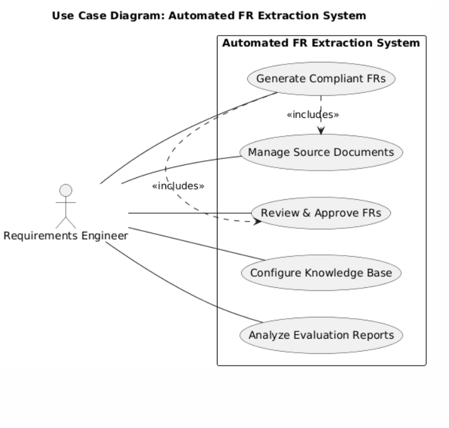
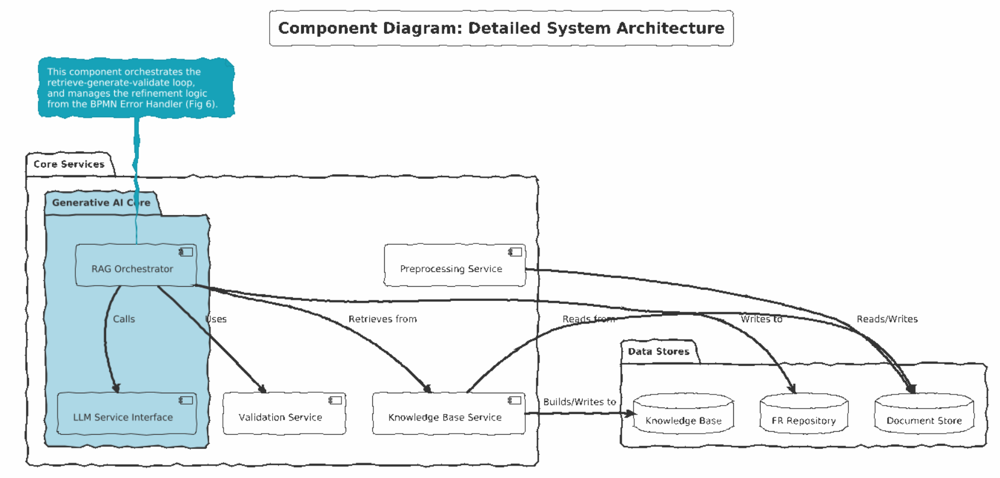
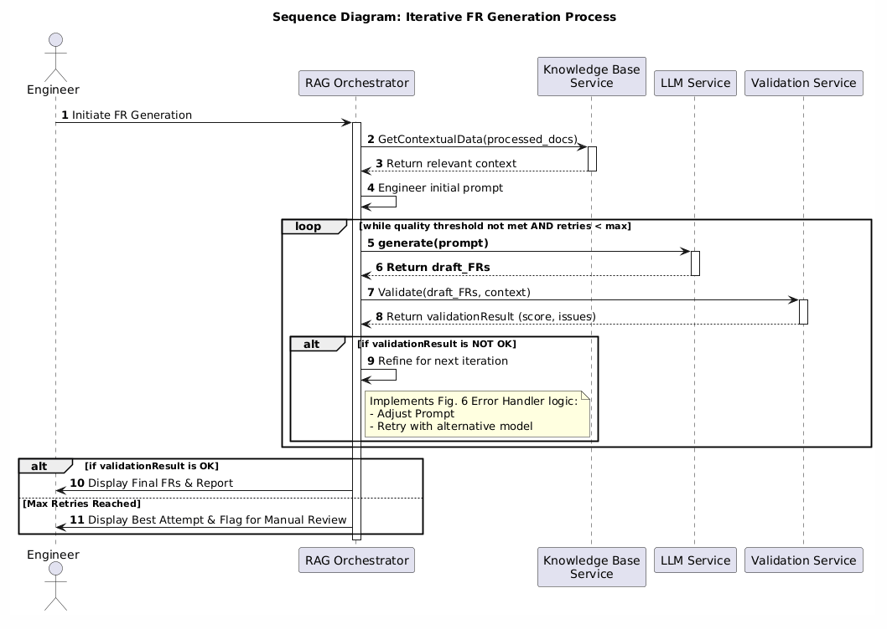

## 1. Project Focus: A Solution for the Healthcare & MedTech Sector

This project proposes a systematic framework for automated Functional Requirement (FR) extraction, designed to address the unique challenges of industries where software quality is directly linked to human safety and stringent regulatory oversight.

The **Healthcare & MedTech sector** was strategically selected as the primary application domain for this solution. This industry is characterized by:
-   **Extreme Regulatory Demands:** Compliance with standards like the EU's MDR, HIPAA, and FDA regulations is mandatory, not optional.
-   **High-Stakes Environments:** Software errors can have direct and severe consequences for patient safety and clinical outcomes.
-   **Complex, Hybrid Data Sources:** Requirements are derived from a mix of clinical guidelines, scientific research, and agile development artifacts.

Within this sector, the ideal target company is one that operates at the cutting edge of innovation and faces the highest level of these challenges.

### Spotlight Company: Oxipit

The chosen company to exemplify this use case is **Oxipit**, a Lithuanian-based, world-leading innovator in medical AI.

Oxipit develops state-of-the-art Artificial Intelligence solutions for medical imaging. Their flagship product, **ChestLink**, is the first and only CE-certified AI application capable of performing **autonomous diagnostics** on chest X-rays. It automatically reports on scans that it determines to be completely healthy, without any oversight from a human radiologist. This places their software in the highest-risk category, where accuracy, reliability, and compliance are paramount.

### Why Oxipit is the Ideal Fit for This Solution

As a pioneer in autonomous diagnostics, Oxipit perfectly embodies the critical needs that this project's framework is designed to solve.

#### 1. Uncompromising Regulatory and Safety Demands
Oxipit operates at the apex of regulatory scrutiny. An autonomous system is subject to the strictest interpretations of medical device regulations. A single error in a requirement could lead to a flawed algorithm, a misdiagnosis, and severe patient harm.

*   **How this project helps:** The core strength of our solution is its emphasis on **compliance verification** and **consistency checking**. The framework uses a knowledge base of regulatory standards to ensure that every extracted FR is not only technically sound but also verifiably compliant, directly mitigating Oxipit's primary business and safety risk.

#### 2. Complex and Heterogeneous Requirements Environment
The development of medical AI is fueled by a wide array of data sources. Oxipit's requirements are derived from clinical guidelines (semi-structured text), radiologists' notes (unstructured text), formal software specifications (structured documents), and agile development artifacts like user stories and change requests.

*   **How this project helps:** Our methodology is explicitly designed to handle this diversity. The document preprocessing and RAG (Retrieval-Augmented Generation) components can ingest these varied inputs and synthesize them into a coherent, standardized set of FRs. This turns a complex, manual analysis task into an efficient, automated workflow.

#### 3. Technological Synergy: Using AI to Make AI Safer
As an AI-native company, Oxipit understands the inherent challenges of modern AI development, including the potential for model "hallucinations" or unexpected behavior. They would immediately recognize the value of a sophisticated, LLM-based system designed to bring structure and verifiability to the development lifecycle.

*   **How this project helps:** Our solution uses a state-of-the-art LLM and RAG architecture to ground its outputs in verified domain knowledge, significantly reducing the risk of generating incorrect or ambiguous requirements. It represents a meta-level application of AI: using one AI system to enforce the safety and quality of another.

#### 4. Accelerating Innovation in a High-Stakes Field
For a market leader like Oxipit, the speed of innovation is a key competitive advantage. However, this speed cannot come at the expense of safety. The manual process of drafting, reviewing, and validating requirements is often a major bottleneck that slows down development and regulatory submission cycles.

*   **How this project helps:** By automating the extraction and initial validation of FRs, our framework can dramatically reduce the time spent in the early phases of the SDLC. This allows Oxipit's expert engineers and clinicians to focus on higher-level design and validation tasks, enabling them to innovate faster while simultaneously enhancing the quality and safety of their products.

### Conclusion

In summary, by targeting the demanding Healthcare & MedTech sector and spotlighting **Oxipit**, we demonstrate the profound relevance and impact of this project. Oxipit is not just a suitable company; it is the **optimal archetype** for a business where our solution can provide transformative value.

## 2. System Architecture and GAI Integration (UML)

To translate the process-oriented BPMN diagrams into a clear software design, the following Unified Modeling Language (UML) diagrams illustrate the system's architecture and the dynamic interactions of its components. These diagrams provide a software-centric view, highlighting how Generative AI is structurally and behaviorally integrated into the solution.
## 1. Use Case Diagram: System Scope and User Goals
This diagram provides a high-level overview of the system from the perspective of its primary user, the Requirements Engineer. It defines the system's boundaries and the core functionalities it offers to achieve the main goal: generating compliant Functional Requirements.

## 2. Component Diagram: System Architecture
This diagram presents the static, architectural blueprint of the solution. It breaks the system down into logical, modular components and shows their relationships. This view clearly isolates the Generative AI Core and its dependencies on other services and data stores, reflecting the modular design implied by the BPMN sub-processes.

## 3. Sequence Diagram: Dynamic Interaction and Refinement Loop
This is the most detailed diagram, illustrating the dynamic, step-by-step interactions between the components to process a single request. Critically, it visualizes the iterative refinement loop, a sophisticated feature derived from the BPMN error handling and quality gateways. This shows how the system doesn't just generate output once, but actively works to improve its quality based on continuous validation.

